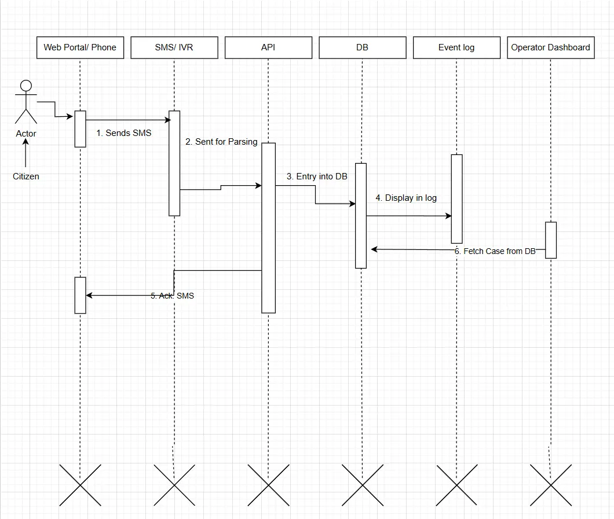
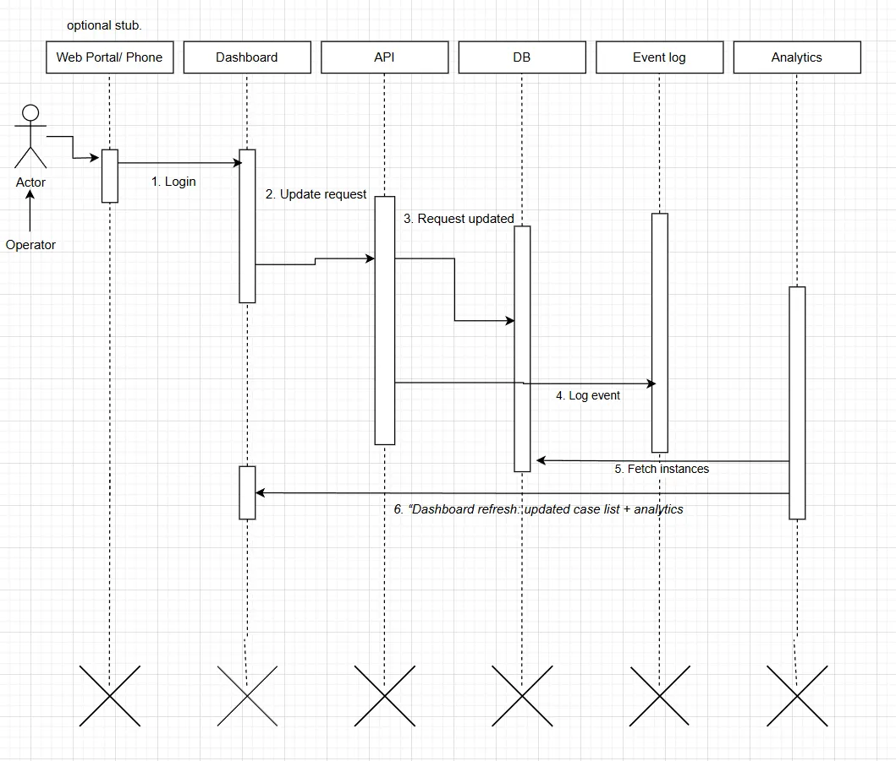
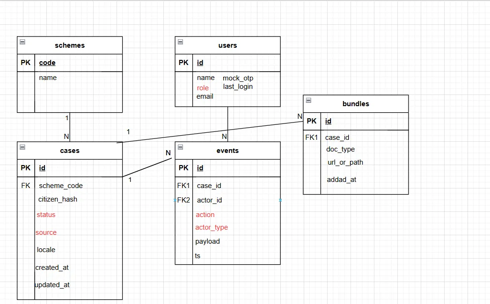

# Software Design Document (SDD)

**Version:** v0.1 (Deploy-ready)

**Owner:** Parth Mody

**Objective:** Deliver a field-testable, citizen-centred prototype that demonstrates one complete E2E flow (Citizen → Operator → Analytics) with strict MoSCoW scope.

---

## 0. Contents

- [1. Executive Summary](#1-executive-summary)
- [2. Scope & Non-Functional Goals](#2-scope--non-functional-goals)
- [3. System Context](#3-system-context)
- [4. Key Use Cases](#4-key-use-cases)
- [5. Sequence Diagrams](#5-sequence-diagrams)
- [6. Data Model](#6-data-model)
    - [6.1 ER Diagram](#61-er-diagram)
    - [6.2 Data Dictionary](#62-data-dictionary)
    - [6.3 Enums](#63-enums)
    - [6.4 Indexes & Constraints](#64-indexes--constraints)
- [7. API Surface (v0)](#7-api-surface-v0)
- [8. Testing Plan (v0)](#8-testing-plan-v0)
- [9. Security, Privacy & Accessibility](#9-security-privacy--accessibility)
- [10. Run & Deploy (summary)](#10-run--deploy-summary)
- [11. Acceptance Criteria (Must-haves)](#11-acceptance-criteria-must-haves)
- [12. Risks & Mitigations](#12-risks--mitigations)
- [13. Changelog](#13-changelog)

---

## 1. Executive Summary

SARAL v1 proves a minimal but complete pathway for low-literacy citizens to open a welfare case via **SMS (mock/test harness)**, for an **Operator** to triage and update status, and for **Analytics** to reflect system state in real time. This SDD documents the context, flows, data model, acceptance criteria, and deploy notes.

## 2. Scope & Non-Functional Goals

**In scope (v1):** API, Database, Operator Dashboard, Event Logging, simple Analytics.

**Out of scope:** Real telco/IVR integration (stubs only), high-fidelity UI, complex external system integrations.

**Non-functional goals**

- Single-VM deploy; low ops overhead.
- Synthetic data only; no plaintext PII in DB.
- Trivial local onboarding (README + seed script).
- Accessibility: readable defaults; icon+text actions.

---

## 3. System Context

**Actors**

- **Citizen** (SMS / test harness)
- **Operator** (Dashboard user)

**Core components** (inside SARAL boundary)

- **API Layer** ↔ **Database** (cases, events, bundles)
- **Operator Dashboard & Analytics**
- **Event Log** (taxonomy: action, actor, case_id, time)

---

## 4. Key Use Cases

- **UC-1 Create Case (Citizen SMS):** citizen sends SMS intent → case stored → ack with case ID.
- **UC-2 Update Status (Operator):** operator selects case → updates status → event logged → analytics refresh.
- **UC-3 View Analytics (Operator/Supervisor):** counts by scheme and status; simple filter.

---

## 5. Sequence Diagrams

**Citizen → Case Creation**

> In this flow, a Citizen initiates a welfare case by sending an SMS. The SMS/IVR layer forwards the request to the SARAL API, which parses the message and creates a new case entry in the database. Each case creation triggers an event log entry. The API then acknowledges the citizen with a confirmation SMS containing the case ID. Finally, the case is retrievable by the Operator Dashboard, ensuring it is visible for triage and further action.
> 

**Operator → Status Update**

> The Operator signs in and selects a case from the dashboard. The UI requests the case details from the API, which retrieves the latest record from the database. When the Operator submits a new status, the API validates and applies the change, persists it to the database, and appends an UPDATE_STATUS event linked to the case ID. The dashboard then refreshes the case list and analytics, and returns a confirmation to the Operator.
> 

---

## 6. Data Model

### 6.1 ER Diagram

### 6.2 Data Dictionary

### `schemes`

| Column | Type | Constraints | Example |
| --- | --- | --- | --- |
| code | TEXT | **PK** | `UJJ` |
| name | TEXT | NOT NULL | `PM Ujjwala Yojana` |

### `users`

| Column | Type | Constraints | Example |
| --- | --- | --- | --- |
| id | UUID | **PK** | `u_123` |
| name | TEXT | NOT NULL | `Operator A` |
| role | ENUM(`OPERATOR`,`SUPERVISOR`) | NOT NULL | `OPERATOR` |
| email | TEXT | UNIQUE, NOT NULL | `operator@example.com` |
| mock_otp | TEXT | Dev-only | `123456` |
| last_login | TIMESTAMPTZ | NULL | `2025-09-29T09:30:00Z` |

### `cases`

| Column | Type | Constraints | Example |
| --- | --- | --- | --- |
| id | UUID | **PK** | `c_101` |
| scheme_code | TEXT | **FK → schemes.code** | `UJJ` |
| citizen_hash | TEXT | NOT NULL (hashed+salted) | `hash$afk93...` |
| status | ENUM(`NEW`,`IN_REVIEW`,`APPROVED`,`REJECTED`) | NOT NULL (default `NEW`) | `NEW` |
| source | ENUM(`SMS`,`WEB`) | NOT NULL | `SMS` |
| locale | TEXT | NOT NULL | `hi` |
| created_at | TIMESTAMPTZ | default `now()` | `2025-09-29T09:00:00Z` |
| updated_at | TIMESTAMPTZ | auto-update | `2025-09-29T10:00:00Z` |

### `events`

| Column | Type | Constraints | Example |
| --- | --- | --- | --- |
| id | UUID | **PK** | `e_1001` |
| case_id | UUID | **FK → [cases.id](http://cases.id/) ON DELETE CASCADE** | `c_101` |
| actor_id | UUID | FK → [users.id](http://users.id/) (nullable) | `u_123` |
| action | ENUM(`CREATE_CASE`,`UPDATE_STATUS`,`LOGIN`) | NOT NULL | `CREATE_CASE` |
| actor_type | ENUM(`CITIZEN`,`OPERATOR`,`SYSTEM`) | NOT NULL | `CITIZEN` |
| payload | JSONB | Optional details | `{"raw":"apply gas"}` |
| ts | TIMESTAMPTZ | default `now()` | `2025-09-29T09:01:00Z` |

### `bundles`

| Column | Type | Constraints | Example |
| --- | --- | --- | --- |
| id | UUID | **PK** | `b_2001` |
| case_id | UUID | **FK → [cases.id](http://cases.id/) ON DELETE CASCADE** | `c_101` |
| doc_type | TEXT | NOT NULL | `ID_PROOF` |
| url_or_path | TEXT | NOT NULL | `/docs/id123.pdf` |
| added_at | TIMESTAMPTZ | default `now()` | `2025-09-29T09:15:00Z` |

### 6.3 Enums

- **status:** `NEW` \| `IN_REVIEW` \| `APPROVED` \| `REJECTED`
- **source:** `SMS` \| `WEB`
- **action:** `CREATE_CASE` \| `UPDATE_STATUS` \| `LOGIN`
- **actor_type:** `CITIZEN` \| `OPERATOR` \| `SYSTEM`
- **role:** `OPERATOR` \| `SUPERVISOR`

### 6.4 Indexes & Constraints

- `cases(status)`, `cases(scheme_code)`, `cases(citizen_hash)`
- `events(case_id, ts)`
- `bundles(case_id)`
- `users(email)` UNIQUE

---

## 7. API Surface (v0)

*(Full OpenAPI can be added later; this is enough to implement.)*

- **POST `/cases`** → create case (from SMS parse)
    
    **Req** `{ citizen_hash, scheme_code, source, locale }`
    
    **Res 201** `{ id, status }`
    
- **GET `/cases/{id}`** → retrieve case
    
    **Res 200** `{ id, scheme_code, status, locale, created_at }`
    
- **PATCH `/cases/{id}/status`** *(operator; header `X-Mock-OTP`)*
    
    **Req** `{ status }`
    
    **Res 200** `{ ok: true }`
    
- **GET `/metrics?group=scheme,status&since=...`** → counts
    
    **Res 200** `{ by_scheme: {...}, by_status: {...} }`
    
- **(optional)** **POST `/events`** → log custom event

**Error shape:** `{ "error":"<CODE>", "detail":"<human-readable>" }`

---

## 8. Testing Plan (v0)

**Happy paths**

- HP1: Create case → 201; GET returns same record.
- HP2: Update status → event logged; GET reflects change.
- HP3: Metrics reflect counts after multiple updates.

**Edge/negative**

- Malformed create → 400 `VALIDATION_ERROR`.
- Invalid PATCH status → 400.
- Unknown case id → 404.
- Missing `X-Mock-OTP` on operator route → 401.
- Duplicate `(citizen_hash, scheme_code)` policy: reject `409` or merge (documented).

**Security/Privacy**

- DB dump has **no plaintext PII**; only `citizen_hash`.
- Config via `.env`; secrets never committed.

**Accessibility (Dashboard)**

- Base font ≥16px; keyboard nav; icon+text buttons; color-blind friendly check.

**Exit criteria**

- All HP tests green locally **and** on cloud VM; 0 P1 bugs.

---

## 9. Security, Privacy & Accessibility

- Synthetic data only; no real citizen PII in any environment.
- Citizen identifiers are hashed+salted; do not store raw numbers.
- Mock OTP only; no live SMS.
- Access logs kept local; purge on teardown.
- A11y: avoid modal-only flows; ensure readable contrast.

---

## 10. Run & Deploy (summary)

- **Local:** Docker Compose or bare Python env; Postgres 15; `scripts/seed_cases.*` to create demo data.
- **Cloud (single VM):** Dockerized API + Postgres; daily `pg_dump`; optional Nginx reverse proxy.
- **Rollback:** stop stack → drop/restore DB volume → re-seed.

*(Full steps live in `docs/run_deploy.md` in a later commit.)*

---

## 11. Acceptance Criteria (Must-haves)

- Citizen SMS mock/test harness **creates** cases; **ack** returns case ID.
- Operator Dashboard **lists** open cases and **updates** status reliably.
- Event logging writes `CREATE_CASE` / `UPDATE_STATUS` with case linkage.
- Analytics show counts by scheme and status.
- Data model deployed with 5–10 seed cases; scripts exist to create/search/update.
- README includes setup and data safety notes.

---

## 12. Risks & Mitigations

- **Scope creep:** freeze by **12 Oct**; push extras to Should/Could.
- **Time pressure:** implement one solid SMS E2E flow first.
- **Ethics/data risk:** synthetic data only; verify DB dumps.
- **Deploy friction:** single-VM, Dockerized; seed scripts.

---

## 13. Changelog

- **v0.1 (2025-09-29):** Initial deploy-ready SDD with context, sequences, ERD, data dictionary, API surface, tests, and acceptance criteria.
